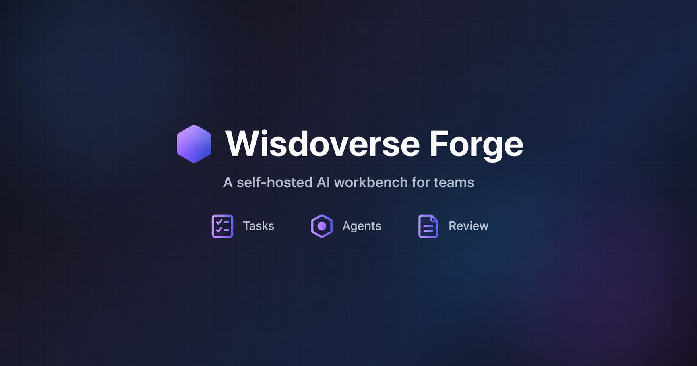
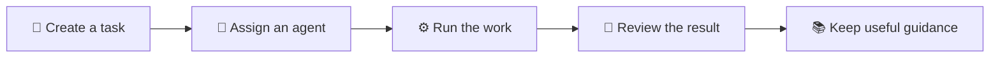

# Wisdoverse Forge

<p align="center">
  
</p>

<p align="center">
  <strong>Run agent work. Review results. Keep useful knowledge.</strong>
</p>

<p align="center">
  <a href="https://github.com/Wisdoverse/Wisdoverse-Forge/actions/workflows/ci.yml"></a>
  <a href="https://securityscorecards.dev/viewer/?uri=github.com/Wisdoverse/Wisdoverse-Forge"></a>
  <a href="LICENSE"></a>
</p>

<p align="center">
  <a href="#running-wisdoverse-forge">🚀 Quickstart</a> ·
  <a href="#what-it-provides">✨ Features</a> ·
  <a href="#documentation">📖 Documentation</a> ·
  <a href="CONTRIBUTING.md">🤝 Contribute</a> ·
  <a href="SUPPORT.md">💬 Get help</a>
</p>

Wisdoverse Forge is a self-hosted AI workbench for teams.
It brings tasks, agents, execution records, and human review into one workspace.
Your deployment stores project context and work evidence.
You choose the AI services and tools that agents use.

> **Early access.** Start with a local trial.
> Use the [runtime validation guide](docs/runbooks/runtime-validation.md) before a deployment serves a real team.
> Source is available under [BSL 1.1](LICENSE).
> Commercial production and hosted services require a separate written license.

## What It Provides

| | Capability | What you get |
| --- | --- | --- |
| 📝 | **Tasks and runs** | A task board, run history, and visible progress for each project |
| 🤖 | **Agent choices** | Agents for project files, managed local machines, and chat |
| 🔎 | **Review and evidence** | Results, activity, and work records in one place |
| 🛠️ | **Repository maintenance** | Draft PRs, verification reports, recovery, and human review for one configured repository |
| 🧩 | **Reusable guidance** | Skills, plugins, prompts, and shared context for repeat work |
| 🔐 | **Team controls** | Workspace access controls and encrypted provider credentials |
| 🩺 | **Operations** | Health and update pages with setup and recovery guidance |
| 🌐 | **Language choices** | English and Chinese UI text |

**Project files** agents work with shared project files.
**This computer** agents work from a managed local machine.
**Simple chat agents** support planning and review in Chat.
Chat agents cannot receive Tasks.

The [maintenance workflow](docs/guides/maintenance-delivery.md) keeps reported verification, observed GitHub checks, and human decisions separate.
A saved acceptance decision does not merge a PR.
The [self-fix guide](docs/guides/self-fix-loop.md) explains repository setup and merge controls.

### From a request to a reviewed result



Saving reusable guidance is optional.

## Running Wisdoverse Forge

### What you need first

| Tool | Requirement |
| --- | --- |
| 🐳 Docker | Docker Engine or Docker Desktop with Compose v2 and a running daemon |
| 🟢 Node.js | Version 24.15 or later, with npm |
| 🧰 Shell tools | Git, Make, Bash, and curl |
| 🌍 Network | Access to package and container registries for the first installation |

The full local stack needs resources for the browser, backend services, and agent containers.
The commands below use Bash.
On Windows, use a Bash environment such as WSL with Docker integration.
For native CLI installation, use the [platform guide](docs/guides/cli-platform-support.md).

### Option 1. One-command start

From a terminal, run:

```bash
git clone https://github.com/Wisdoverse/Wisdoverse-Forge.git wisdoverse-forge
cd wisdoverse-forge
make product
```

`make product` installs missing app dependencies and prepares `docker/.env`.
It starts the backend services and performs health checks.
It starts the browser app and attempts to open `http://localhost:4002`.

**Your first task:**

1. Open `http://localhost:4002`.
2. On a fresh local installation, register the first account.
3. Follow the **Start** checklist for team, project, and tool setup.
4. For a task with file access, create a **Project files** or **This computer** agent.
5. Create one small task in **Tasks**.
6. Open the task's **Result** after the run completes.
7. Read **Activity** to examine what happened.

The [first-use guide](docs/guides/getting-started.md#4-first-use-path) gives the complete setup sequence.

**Stop or recover:**

- Press **Ctrl+C** to stop the browser and the backend services that this command started.
- To stop the local backend later, run `make product-down`.
- If startup fails, read service logs with `make dev-logs`.
- Use the [troubleshooting guide](docs/guides/troubleshooting.md) for the next recovery step.

<details>
<summary>⚙️ Other setup paths</summary>

### Option 2. Ask an agent to set it up

Give your coding agent this instruction:

> Read `docs/guides/getting-started.md`.
> Confirm that the prerequisites are available.
> Run `make product`.
> Report the app address and health results.
> Keep credentials and private deployment details out of logs and commits.

The browser checklist provides the account and agent setup steps.

### Option 3. Work on this repository

For separate terminals, prepare the backend first:

```bash
npm install
make quickstart-local
```

In another terminal, start the browser app:

```bash
npm run dev
```

Before edits, read [AGENTS.md](AGENTS.md) and [CONTRIBUTING.md](CONTRIBUTING.md).
Use the contribution guide's validation table for the changed area.

### Option 4. Implement a compatible service

Use [SPEC.md](SPEC.md) for the service contract.
Use [shared/types/](shared/types/) for protocol types.
Use [runtime validation](docs/runbooks/runtime-validation.md) for the verified runtime boundary.

### Self-host or connect a local machine

- For a server deployment, follow [Getting Started](docs/guides/getting-started.md) and [Deployment](docs/guides/deployment.md).
- For a managed local agent, follow [Host CLI Enrollment](docs/runbooks/host-cli-agent-enrollment.md).
- For installation without internet access, follow [Offline Install](docs/guides/offline-install.md).

</details>

## Documentation

| | Start here | Purpose |
| --- | --- | --- |
| 🚀 | [Getting Started](docs/guides/getting-started.md) | Local trial and first task |
| ⚙️ | [Configuration](docs/guides/configuration.md) · [Deployment](docs/guides/deployment.md) | Environment settings and server setup |
| 🛠️ | [Self-Fix Loop](docs/guides/self-fix-loop.md) · [Maintenance Delivery](docs/guides/maintenance-delivery.md) | Repository setup, verification, review, and handoff |
| 💻 | [CLI Platform Support](docs/guides/cli-platform-support.md) · [Host CLI Enrollment](docs/runbooks/host-cli-agent-enrollment.md) | Operator CLI and managed local agents |
| 🏗️ | [Architecture](docs/architecture/overview.md) · [Service Contract](SPEC.md) | Runtime topology and API contracts |
| 🧪 | [Runtime Validation](docs/runbooks/runtime-validation.md) | Reproducible evidence and current limitations |
| 🧭 | [Roadmap](ROADMAP.md) · [Product Validation](docs/guides/product-validation.md) | Planned work and optional outcome evaluation |
| 📚 | [Documentation Index](docs/README.md) | Full guide and runbook map |

### Current direction

The next cycle focuses on dependency upgrades and failed-PR repair for one approved repository.
The [roadmap](ROADMAP.md) defines delivery priorities and quality gates.
Available workflow records do not establish autonomous maintenance, adoption, or measured time savings.

## Repository Map (for agents)

The backend uses Rust with PostgreSQL, Redis, NATS, RustFS, Docker, and Temporal.
The browser app uses React, Vite, and Three.js.
The [architecture overview](docs/architecture/overview.md) describes service ownership and event flow.

<details>
<summary>🗂️ Explore the source tree</summary>

```text
rust/                  Active Rust backend workspace
  crates/core/         Domain types, errors, and tenant scope
  crates/db/           SQLx pool, migrations, and persisted entities
  crates/auth/         JWT, Argon2, and auth middleware
  crates/infra/        Redis and NATS clients
  crates/api/          Axum routes, services, domain types, repositories, and WebSocket gateway
  crates/platform/     Docker runtime, security policy, and warm pool
  crates/jobs/         PostgreSQL task queue
  crates/llm/          Provider gateway
  crates/orchestrator/ Temporal workflows
  crates/cli/          Platform CLI library
  bins/server/         API binary
  bins/orchestrator/   Orchestrator binary
  bins/sidecar/        Agent container sidecar
  bins/cli/            agentforge operator CLI
src/app/               Active browser app with Feature-Sliced Design boundaries
shared/                TypeScript contracts and generated protocol output
hooks/                 Agent event relay
docker/                Dockerfiles and Compose profiles
tests/                 Vitest and Playwright suites
docs/                  Architecture, guides, runbooks, and service contracts
```

Imports follow `app -> pages -> widgets -> features -> entities -> shared`.
The [DDD contract](docs/architecture/ddd-contract.md) defines backend layer boundaries.
The [aggregate catalog](docs/architecture/aggregate-catalog.md) lists domain modules.

</details>

## Community

| | How to take part |
| --- | --- |
| 🤝 | [Contribute code or documentation](CONTRIBUTING.md) |
| 🐛 | [Report a bug](https://github.com/Wisdoverse/Wisdoverse-Forge/issues/new?template=bug_report.yml) |
| 💡 | [Suggest a feature](https://github.com/Wisdoverse/Wisdoverse-Forge/issues/new?template=feature_request.yml) |
| 💬 | [Get setup help](SUPPORT.md) |
| 🛡️ | [Report a vulnerability privately](SECURITY.md) |
| 💜 | [Read the Code of Conduct](CODE_OF_CONDUCT.md) |

For a contribution, use the [repository writing standards](docs/README.md#writing-standards).
Keep secrets and private deployment details out of public issues and PRs.

## License

Wisdoverse Forge is source available under the [Wisdoverse Forge BSL 1.1](LICENSE).
Before a version's change date, the license permits learning, research, education, development, testing, internal evaluation, and non-production use.
Commercial production, hosted services, resale, and competing products require a separate written commercial license.
Each version changes to Apache License 2.0 four years after Wisdoverse first makes that version publicly available.
See [LICENSE](LICENSE) for the complete terms.
